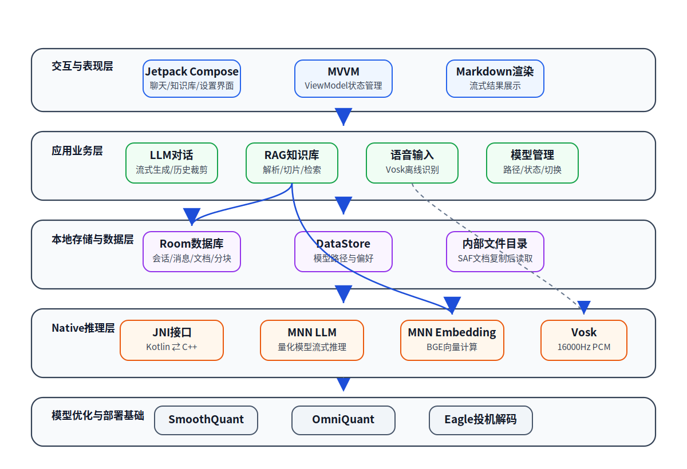

# 面向端侧部署的大语言模型量化与投机推理方法研究及安卓应用实现

> 说明：本文件是在现有大纲、项目代码与实验材料基础上生成的本科毕业论文扩充稿。当前先完成第1章“绪论”的扩充，后续章节可继续在同一写作风格下逐章追加。文中涉及的模型性能、可用性与选型结论优先采用项目目录中的真实实验结果。

## 摘要撰写预留

本文面向移动设备资源受限场景下的大语言模型本地化部署问题，围绕模型量化、投机推理与 Android 端侧应用实现展开研究。后续章节完成后，应在此处补充中文摘要、关键词、英文摘要与 Keywords。

## 第1章 绪论

### 1.1 课题背景及研究的目的和意义

近年来，大语言模型（Large Language Model，LLM）在自然语言理解、文本生成、多轮对话、代码辅助和知识问答等任务中表现出较强的通用能力。随着模型参数规模和上下文处理能力持续提升，LLM 正逐渐从云端服务形态向个人终端、移动设备和嵌入式设备延伸。相较于云端推理，端侧部署具有数据不出设备、网络依赖低、响应链路短和个性化能力更强等优势，特别适合私有文档问答、移动智能助手、离线语音交互和现场辅助决策等应用场景。

然而，大语言模型在端侧部署过程中仍面临明显的资源约束。移动设备的 CPU、GPU、NPU、内存容量、电池续航和散热能力均显著弱于服务器环境，而 LLM 推理通常需要加载大规模权重并持续执行矩阵乘法计算。以数十亿参数规模的模型为例，即使采用半精度浮点格式，模型权重、KV Cache 和中间激活也可能占用数 GB 内存，直接在普通 Android 手机上部署容易出现加载时间过长、生成速度偏低、内存占用过高甚至进程被系统回收等问题。因此，如何在保持模型能力的前提下降低推理资源消耗，是端侧 LLM 应用落地的关键问题。

模型量化是解决上述问题的重要技术路线。量化通过降低权重或激活值的表示位宽，将 FP16/FP32 等浮点计算转化为更低位宽的整数或混合精度计算，从而减少模型存储空间、降低内存带宽压力并提升推理速度。与此同时，投机解码通过引入较小的草稿模型或预测模块提前生成候选 token，再由主模型进行验证，可在保证生成结果一致性的前提下减少主模型调用次数，提高自回归生成阶段的吞吐率。对于端侧 LLM 而言，量化侧重降低“单次推理成本”，投机解码侧重减少“生成过程调用次数”，二者具有互补性。

除基础推理能力外，移动端智能助手还需要具备本地知识增强和自然交互能力。单纯依赖模型参数记忆的 LLM 存在知识截止时间固定、无法访问用户本地资料、容易产生幻觉等问题。检索增强生成（Retrieval-Augmented Generation，RAG）通过将用户文档切分、向量化并存入本地知识库，在问答时检索相关片段并注入提示词，可提升回答的事实依据和个性化能力。另一方面，移动设备的使用场景具有碎片化、移动化和操作不便等特点，纯文本输入无法满足所有交互需求，离线语音识别可以在无网络条件下将语音转写为文本，为端侧助手提供更自然的输入方式。

基于上述背景，本文以“端侧部署的大语言模型量化与投机推理方法研究及安卓应用实现”为主题，首先在实验层面对多种量化和投机推理组合进行评估，然后将筛选出的部署方案集成到 Android 应用中，实现包含流式对话、RAG 知识库、离线语音输入、模型切换和提示词模板管理的端侧 LLM 验证平台。该研究具有以下意义：

（1）在研究层面，本文通过 SmoothQuant、OmniQuant、不同量化位宽以及 Eagle 投机推理的交叉实验，比较不同模型压缩与加速策略在精度、速度和内存占用方面的差异，为端侧模型选型提供实验依据。

（2）在工程层面，本文将实验筛选出的模型方案部署到真实 Android 应用环境中，通过 JNI 调用 MNN 推理能力，并集成 Room 数据库、Jetpack Compose 界面、RAG 检索和 Vosk 语音识别，从系统角度验证端侧 LLM 全链路运行的可行性。

（3）在应用层面，本文关注“纯离线、本地知识增强、语音交互和多模型方案切换”四类能力，使应用不只停留在单一聊天演示，而是更接近真实移动智能助手的使用流程。

### 1.2 国内外在该方向的研究现状及分析

#### 1.2.1 大语言模型端侧部署研究现状

现有 LLM 部署方式主要包括云端推理、边缘服务器推理和端侧本地推理三类。云端推理依托服务器集群和高性能 GPU，能够运行更大规模的模型，但需要持续网络连接，并存在隐私数据上传、服务成本和响应链路较长等问题。边缘服务器推理通过在用户附近部署计算节点缩短访问链路，但仍无法完全消除网络依赖。端侧本地推理则将模型权重和推理引擎直接部署在用户设备上，能够在离线状态下提供服务，并避免敏感数据离开设备。

目前已有 MLC Chat、llama.cpp Android 移植和 PocketPal 等端侧 LLM 应用或框架。这些方案证明了在移动设备上运行中小规模 LLM 的可行性，但多数工作仍以基础文本对话和模型加载为主，对 RAG 本地知识库、离线语音输入、模型方案对比、投机解码加速以及完整工程链路测试的支持相对有限。对于本科毕业设计而言，仅实现一个能调用模型的聊天界面不足以充分体现端侧 LLM 的技术难点；更有价值的问题是：在真实 Android 系统的内存管理、JNI 调用、UI 线程调度、文件访问权限和多组件并发约束下，量化 LLM、Embedding 检索和语音识别能否协同工作。

表1-1对典型端侧 LLM 方案与本文工作的功能进行对比。

**表1-1 典型端侧 LLM 方案功能对比**

| 功能维度 | MLC Chat | llama.cpp Android移植 | PocketPal | 本文工作 |
| --- | --- | --- | --- | --- |
| 离线 LLM 推理 | 支持 | 支持 | 支持 | 支持 |
| 流式对话 | 支持 | 支持 | 支持 | 支持 |
| 量化方案对比 | 部分支持 | 部分支持 | 较弱 | 支持，包含多组量化与 Eagle 对比 |
| 投机解码实验 | 较少涉及 | 较少涉及 | 较少涉及 | 支持 Eagle 组合评估 |
| 本地 RAG 知识库 | 较少涉及 | 较少涉及 | 较少涉及 | 支持 PDF、TXT、Markdown、DOCX 导入与检索 |
| 离线语音输入 | 较少涉及 | 较少涉及 | 较少涉及 | 支持 Vosk 离线中文识别 |
| 多会话管理 | 部分支持 | 视实现而定 | 支持 | 支持 |
| 提示词模板管理 | 较少涉及 | 较少涉及 | 较少涉及 | 支持 |
| Android 全链路工程验证 | 部分涉及 | 部分涉及 | 部分涉及 | 重点验证 |

由表1-1可见，现有方案多从“模型能否在端侧跑起来”这一角度出发，而本文更强调“模型优化方案能否在真实端侧应用中稳定发挥作用”。因此，本文不仅关注单次推理速度，也关注知识库构建、向量检索、语音输入、UI 流式渲染和本地持久化等应用链路。

#### 1.2.2 模型量化研究现状

模型量化按训练参与程度可分为量化感知训练和训练后量化。量化感知训练在训练过程中模拟低精度计算，通常能够获得较好的精度保持效果，但训练成本较高，不适合所有模型和应用场景。训练后量化则在已有模型基础上利用少量校准数据完成权重或激活范围估计，部署成本较低，更适合端侧应用快速适配。

在大语言模型量化研究中，GPTQ、AWQ、SmoothQuant 和 OmniQuant 等方法被广泛关注。SmoothQuant 通过平滑权重和激活分布，将激活异常值压力转移到权重侧，降低低位宽量化难度。OmniQuant 则通过可学习参数进一步优化量化误差，试图在较低位宽下保持模型精度。对于端侧部署而言，W4A16 和 W8A8 是常见的两类混合精度或整数化方案：前者主要压缩权重，通常可以显著降低模型体积；后者同时压缩权重和激活，理论上具有更高计算加速潜力，但对模型分布和算子支持要求更高。

本文实验结果显示，并非所有低位宽方案都适合直接部署。项目实验记录中，`smoothw8a8` 和 `smoothw8a8_eagle` 被标记为不可用，原因是量化效果不好；而 `smoothw4a16_eagle` 在有效候选模型中取得综合最优结果，其 decode 速度达到 37.1 tokens/s，内存占用为 2.93 GB，综合加权得分为 0.6885。这说明端侧模型选型不能只依据理论压缩率，而应综合考虑精度退化、推理速度、内存占用和框架兼容性。

#### 1.2.3 投机解码研究现状

自回归语言模型在生成阶段需要逐 token 迭代，每生成一个 token 都依赖前序上下文。该机制使 decode 阶段难以充分并行化，尤其在移动端 CPU 或移动 GPU 上容易成为性能瓶颈。投机解码通过草稿模型先生成若干候选 token，再由主模型一次性验证，从而减少主模型调用次数。当草稿结果被主模型接受时，可以在不改变最终分布或尽量保持输出质量的前提下提升生成速度。

Eagle 属于面向 LLM 推理加速的投机生成方法。相较于简单使用小模型进行候选生成，Eagle 利用更贴近主模型隐藏状态或生成分布的预测机制，提高候选 token 的接受率。对端侧部署而言，Eagle 的优势在于能够提升 decode 吞吐率，但代价是需要额外加载草稿相关模型或模块，并增加一定内存消耗。因此，是否启用 Eagle 不能孤立判断，而需要与量化方案共同评估。

本文实验材料显示，不同模型启用 Eagle 后 decode 速度均有不同程度提升。例如，`smoothw4a16` 的 decode 速度为 19.26 tokens/s，叠加 Eagle 后 `smoothw4a16_eagle` 提升至 37.1 tokens/s；`omniw4a16` 从 22.62 tokens/s 提升至 `omniw4a16_eagle` 的 31.89 tokens/s。该结果表明，投机解码对于端侧生成阶段具有明显加速潜力，但最终选型仍需结合精度和内存进行多指标分析。

#### 1.2.4 端侧知识增强与语音交互研究现状

RAG 技术通过外部知识检索弥补模型参数知识的局限，通常包括文档解析、文本切片、向量化、相似度检索和提示词拼接等步骤。云端 RAG 系统通常依赖向量数据库和远程 Embedding 服务，而端侧 RAG 需要在本地完成文档读取、向量计算、向量存储和检索排序。Android 系统的文件访问权限、数据库存储效率和模型推理速度都会影响端侧 RAG 的用户体验。

语音输入是移动端应用的重要交互方式。在线语音识别服务准确率高、模型更新方便，但需要上传音频数据，不适合隐私敏感或离线环境。Vosk 等离线语音识别框架提供了在本地运行小型声学模型的能力，能够满足基础语音转写需求。本文将 Vosk 集成到 Android 应用中，使用户可以通过语音输入问题，再由本地 LLM 或 RAG 流程完成回答，从而形成“语音输入—文本理解—知识检索—LLM生成—流式展示”的端侧交互闭环。

### 1.3 本文主要研究内容

本文围绕端侧 LLM 部署的“模型优化—方案选型—系统实现—测试验证”展开，主要研究内容如下。

（1）构建面向端侧部署的量化与投机推理实验。本文以项目中的端侧多模态大模型部署需求为背景，对 FP16 基线、SmoothQuant、OmniQuant、W4A16、W8A8 以及 Eagle 投机推理组合进行实验比较。根据实验记录，共有 8 个有效候选模型进入帕累托分析，优化目标包括 accuracy、decode speed 和 memory。

（2）基于真实实验数据完成模型部署方案选优。实验结果显示，`fp16` 的 decode 速度为 3.49 tokens/s，`fp16_eagle` 为 29.95 tokens/s，`omniw4a16_eagle` 为 31.89 tokens/s，`smoothw4a16_eagle` 为 37.1 tokens/s。帕累托分析最终选择 `smoothw4a16_eagle`，其平均得分为 0.2098，decode 速度为 37.1 tokens/s，内存占用为 2.93 GB，综合加权得分为 0.6885。本文后续系统实现以该结果作为端侧部署方案的重要依据。

（3）实现 Android 端侧 LLM 应用系统。系统采用 Kotlin 和 Jetpack Compose 构建界面，使用 Room 进行本地数据持久化，通过 JNI 调用 C++ 层 MNN 推理能力。应用包括聊天对话、模型管理、知识库管理、提示词模板管理和设置等功能模块，能够支撑多会话隔离、流式生成和模型切换等典型使用流程。

（4）实现本地 RAG 知识库能力。系统支持用户导入 PDF、TXT、Markdown 和 DOCX 文档，将文档复制到应用内部存储后进行解析、切片和向量化。Embedding 模型在端侧运行，生成的向量与文档分块信息存入本地数据库。用户提问时，系统可检索相似分块并作为上下文注入提示词，从而提升回答的依据性。

（5）集成离线语音识别能力。系统通过 Vosk 实现本地语音识别，将用户语音实时转写为文本输入，避免依赖云端语音服务。该模块与聊天输入框和推理流程联动，为移动端场景提供更自然的交互方式。

（6）开展系统测试与结果分析。本文将结合功能测试、模型推理性能测试、RAG 检索测试和语音识别测试，对系统可用性和端侧部署效果进行分析，并讨论 PC 端实验结果与 Android 真机运行环境之间的差异。

### 1.4 本文技术路线

本文的技术路线如图1-1所示。整体流程从端侧 LLM 部署问题出发，首先进行量化与投机推理实验，得到适合端侧部署的模型方案；随后将该方案与 Embedding、RAG 和 ASR 组件共同集成到 Android 应用中；最后通过功能和性能测试验证系统的可用性，并形成结论。

**图1-1 本文研究技术路线图**

从图1-1可以看出，本文并不是单纯进行模型压缩实验，也不是单纯开发聊天应用，而是将二者结合起来：第3章的实验结果为第4章和第5章的端侧应用设计提供模型选型依据；第6章的系统测试则反过来验证第3章中选定方案在真实移动环境中的工程可行性。

### 1.5 本文创新点

结合研究目标和项目实现，本文的创新点主要体现在以下方面。

（1）提出面向端侧部署的多指标模型选型流程。本文不只比较单一精度或速度指标，而是综合考虑精度、decode 速度、内存占用和模型可用性，利用帕累托前沿方法筛选候选方案。实验结果表明，`smoothw4a16_eagle` 在有效候选模型中具有较优综合表现。

（2）系统比较量化方法与投机解码的组合效果。本文将 SmoothQuant、OmniQuant、W4A16、W8A8 和 Eagle 投机推理进行组合分析，观察不同量化方案叠加 Eagle 后的速度提升和可用性差异，为端侧 LLM 加速提供实验参考。

（3）构建端侧 LLM 全链路工程验证平台。本文实现的 Android 应用不仅包括基础 LLM 对话，还集成了本地 RAG 知识库、Embedding 向量化、离线语音识别、模型管理和提示词模板管理，能够从真实应用链路角度验证端侧 LLM 部署效果。

（4）针对 Android 环境完成 JNI 与本地存储适配。系统通过 JNI 连接 Kotlin 层与 C++ MNN 推理层，同时考虑 Android Scoped Storage 限制，将外部文档复制到应用内部存储后再进行解析和向量化，解决了 C++ 层直接访问外部文件不稳定的问题。

### 1.6 本文结构安排

本文共分为六章和结论部分，各章内容安排如下。

第1章为绪论。主要介绍端侧 LLM 部署的研究背景、目的和意义，分析模型量化、投机解码、端侧 RAG 和离线语音交互的发展现状，明确本文研究内容、技术路线和创新点。

第2章为相关技术基础。主要介绍大语言模型量化技术、投机解码技术、MNN 推理框架、RAG 与 Embedding 技术、Vosk 离线语音识别技术，以及 Android MVVM、Room、Jetpack Compose 和 JNI 等工程实现基础。

第3章为面向端侧的模型量化与投机推理实验。主要说明实验模型、数据集、量化方案、Eagle 配置、评估指标和实验环境，并基于真实实验结果分析不同模型方案在精度、速度和内存方面的表现，最终通过帕累托前沿方法确定端侧部署推荐方案。

第4章为端侧 LLM 应用系统需求分析与概要设计。主要分析系统业务流程、功能性需求、非功能性需求和用例模型，给出系统总体架构、数据库设计和核心模块概要设计。

第5章为端侧 LLM 应用系统详细设计与实现。主要介绍 Android 工程结构、LLM 推理模块、JNI 接口、C++ 侧推理实现、RAG 知识库模块、语音识别模块以及 UI 与状态管理的具体实现。

第6章为系统测试与结果分析。主要围绕功能测试、推理性能、RAG 检索耗时、语音识别效果和整体应用体验展开测试，并对测试结果进行分析。

结论部分总结全文工作，归纳模型选型、端侧应用实现和系统测试结果，分析当前工作的不足，并展望后续可改进方向。

### 1.7 本章小结

本章首先分析了大语言模型向移动端部署的发展趋势，指出端侧 LLM 在隐私保护、离线可用和低延迟交互方面具有重要价值，同时也面临内存、算力、功耗和系统集成复杂度等挑战。随后，本章从端侧部署、模型量化、投机解码、RAG 知识增强和离线语音识别等方面梳理了相关研究现状，并结合项目真实实验结果说明本文开展量化选型与 Android 工程验证的必要性。最后，本章明确了本文的主要研究内容、技术路线、创新点和章节安排，为后续相关技术基础、实验设计、系统设计与实现、测试分析奠定了基础。

## 第2章 相关技术基础

### 2.1 引言

第1章明确了本文的研究目标：一方面通过模型量化与投机推理降低大语言模型在端侧部署时的资源消耗，另一方面在 Android 设备上实现一个集成 LLM 推理、RAG 知识库和离线语音识别的完整应用系统。为了支撑后续实验设计与系统实现，本章对本文涉及的关键技术进行说明。

从技术链路上看，本文不是单独使用某一种算法或某一个框架，而是由“模型优化技术”和“端侧工程技术”共同构成。模型优化技术包括大语言模型量化和 Eagle 投机解码，用于解决模型体积大、内存占用高、生成速度慢等问题；端侧工程技术包括 MNN 推理框架、JNI 跨语言调用、Android MVVM 架构、Room 本地数据库、RAG 检索增强生成和 Vosk 离线语音识别，用于将优化后的模型真正部署到移动端应用中。相关技术在本文系统中的位置关系如图2-1所示。

**图2-1 相关技术在本文系统中的位置关系**

由图2-1可知，本文的技术体系可以分为五个层次。最底层是模型优化与部署基础，主要对应 SmoothQuant、OmniQuant 和 Eagle；其上是 Native 推理层，由 JNI、MNN LLM 推理、MNN Embedding 推理和 Vosk 语音识别组成；再上层是本地数据层，负责会话、消息、文档、向量分块和模型路径等数据管理；应用业务层则面向用户提供对话、知识库、语音输入和模型管理等能力；最上层为交互与表现层，通过 Jetpack Compose 和 MVVM 状态管理实现流式对话界面与多页面交互。本章后续各节将按照该技术链路展开介绍。

### 2.2 大语言模型量化技术

#### 2.2.1 量化的基本思想

大语言模型通常由大量 Transformer 层堆叠而成，其核心计算主要是矩阵乘法、注意力计算和前馈网络计算。模型参数通常以 FP16 或 FP32 浮点数形式存储和计算。在服务器环境中，较高精度的数据类型有助于保证模型精度，但在移动端环境中，浮点权重会带来较大的存储空间、内存带宽和计算压力。模型量化的基本思想是使用更低位宽的数据类型近似表示原始浮点参数或激活值，以较小精度损失换取模型体积压缩和推理速度提升。

设原始浮点值为 \(x\)，量化后的整数值为 \(q\)，常见均匀量化可表示为：

\[
q = round(\frac{x}{s}) + z
\]

其中，\(s\) 表示缩放因子，\(z\) 表示零点。反量化时可近似恢复为：

\[
\hat{x} = s(q - z)
\]

如果采用对称量化，则零点通常取 0；如果采用非对称量化，则零点用于表示浮点数值范围与整数范围之间的偏移。对于 LLM 而言，权重矩阵规模巨大，量化权重可以显著降低模型文件体积和加载时内存占用；激活量化则可能进一步提升计算效率，但也更容易受到异常值分布影响。

#### 2.2.2 训练后量化与量化感知训练

按照是否参与重新训练，模型量化可分为量化感知训练（Quantization-Aware Training，QAT）和训练后量化（Post-Training Quantization，PTQ）。QAT 在训练过程中模拟低精度计算，使模型逐渐适应量化误差，通常能够获得更好的精度保持效果，但需要完整训练流程和较高算力成本。PTQ 则在模型训练完成后进行量化，通常只需要少量校准数据，部署成本较低，更适合本文这种以已有开源模型为基础进行端侧适配的场景。

本文实验属于训练后量化范畴。实验中比较了 SmoothQuant 和 OmniQuant 两类方案，并结合 W4A16、W8A8 等位宽配置进行评估。W4A16 表示权重采用 4 bit 量化、激活仍保持 16 bit 精度；W8A8 表示权重和激活均采用 8 bit 表示。二者在端侧部署中的侧重点不同：W4A16 更强调减少权重存储和内存占用，通常对矩阵乘法实现和硬件支持要求相对较低；W8A8 在理论上可进一步降低计算成本，但激活量化难度更高，若校准或分布平滑不足，可能导致明显精度退化。

#### 2.2.3 SmoothQuant 原理

SmoothQuant 是一种面向 Transformer 模型的后训练量化方法。LLM 中激活值常出现少量异常大值，这些异常值会扩大激活张量的动态范围，使低位宽量化难以保持精度。SmoothQuant 的核心思想是通过通道级缩放，将激活侧的量化困难部分平滑转移到权重侧，从而降低激活量化难度。对于线性层计算：

\[
Y = XW
\]

可以引入通道缩放因子 \(S\)，将其等价变换为：

\[
Y = (XS^{-1})(SW)
\]

该变换在数学上不改变线性层输出，但改变了激活和权重的数值分布，使激活更容易被量化。SmoothQuant 通常需要通过校准数据估计激活分布，并选择合适的平滑参数。本文实验中，SmoothQuant 与 W4A16、W8A8 组合后表现并不完全一致：`smoothw4a16` 与 `smoothw4a16_eagle` 可用，而 `smoothw8a8` 和 `smoothw8a8_eagle` 被实验记录标记为不可用，原因是量化效果不好。这说明 SmoothQuant 虽能缓解激活异常值问题，但在具体模型、位宽和推理框架组合下仍需实际验证。

#### 2.2.4 OmniQuant 原理

OmniQuant 同样属于大模型后训练量化方法。与仅依赖静态校准统计的量化方法相比，OmniQuant 引入可学习参数对量化过程进行优化，目标是在不进行完整模型训练的前提下降低量化误差。其基本思想是利用少量校准样本，对权重裁剪范围、缩放参数或等价变换参数进行迭代优化，使量化后模型输出尽可能接近原始模型输出。

在本文实验中，OmniQuant 对应 `omniw4a16`、`omniw4a16_eagle`、`omniw8a8` 和 `omniw8a8_eagle` 等模型方案。实验记录显示，`omniw4a16` 的 decode 速度为 22.62 tokens/s，叠加 Eagle 后 `omniw4a16_eagle` 提升至 31.89 tokens/s；`omniw8a8` 的 decode 速度为 11.75 tokens/s，`omniw8a8_eagle` 为 18.77 tokens/s。该结果表明，OmniQuant 方案在本文模型和 MNN 环境下具有可用性，但不同位宽配置的端侧速度并不只由理论 bit 数决定，还与算子实现、内存访问和投机解码接受率等因素有关。

#### 2.2.5 本文量化技术选型依据

本文最终并不是直接选择理论上压缩率最高的方案，而是综合考虑精度、速度、内存占用和可用性。项目实验中的帕累托分析包含 8 个有效候选模型，优化目标为 accuracy、decode speed 和 memory。最终 `smoothw4a16_eagle` 排名第一，平均得分为 0.2098，decode 速度为 37.1 tokens/s，内存占用为 2.93 GB，综合加权得分为 0.6885。因此，本文后续 Android 应用实现和测试分析均将该方案作为重要参考对象。

### 2.3 投机解码技术

#### 2.3.1 自回归解码的性能瓶颈

大语言模型通常采用自回归方式生成文本，即每次根据已有上下文预测下一个 token，再将生成结果拼接回上下文继续预测。该过程可以表示为：

\[
P(y_1, y_2, ..., y_n|x)=\prod_{t=1}^{n}P(y_t|x,y_1,...,y_{t-1})
\]

这种生成方式具有强顺序依赖，导致 decode 阶段难以像训练阶段那样充分并行化。对于移动端设备而言，decode 阶段通常表现为长时间重复执行小批量矩阵计算，计算资源利用率和内存访问效率都受到限制。即使模型已经量化，逐 token 生成仍可能成为用户感知延迟的主要来源。

#### 2.3.2 投机解码基本流程

投机解码的核心思想是使用一个速度更快的草稿模型或预测模块预先生成多个候选 token，再由目标主模型对这些候选 token 进行验证。如果候选 token 被主模型接受，则一次主模型前向过程可以确认多个 token；如果部分候选不被接受，则从拒绝位置重新采样或回退。其基本流程可概括为：

（1）草稿模型根据当前上下文连续生成若干候选 token；

（2）主模型并行计算这些候选 token 的概率分布；

（3）根据接受规则判断候选 token 是否可被采纳；

（4）将已接受 token 写入输出序列，继续下一轮候选生成与验证。

投机解码的理论优势在于，在保持输出分布一致或近似一致的前提下减少主模型调用次数。实际加速效果取决于草稿模型速度、候选 token 接受率、主模型验证成本和额外内存开销。如果草稿模型预测质量较差，大量候选被拒绝，则加速收益会降低；如果草稿模型过大，则其自身计算和内存开销可能抵消收益。

#### 2.3.3 Eagle 投机解码

Eagle 是一种面向大语言模型推理加速的投机解码方法。与普通小模型草稿生成相比，Eagle 更强调利用主模型中间特征或更贴近主模型分布的预测机制生成候选 token，从而提高候选接受率。对端侧部署而言，Eagle 的价值在于提升 decode 阶段速度，但也会额外引入草稿相关模型文件和运行时内存。

本文实验中的 Eagle 模型目录相比普通模型目录额外包含 `eagle.mnn`、`eagle.mnn.weight`、`eagle_d2t.mnn`、`eagle_fc.mnn` 和 `eagle_fc.mnn.weight` 等文件。这些文件由 MNN 工具链加载后参与投机生成过程。实验结果表明，在可用模型方案中，叠加 Eagle 后 decode 速度普遍提高：`fp16` 从 3.49 tokens/s 提升至 `fp16_eagle` 的 29.95 tokens/s；`smoothw4a16` 从 19.26 tokens/s 提升至 `smoothw4a16_eagle` 的 37.1 tokens/s。由此可见，Eagle 对端侧 LLM 的生成阶段具有明显加速价值。

### 2.4 MNN 端侧推理框架

#### 2.4.1 MNN 框架特点

MNN（Mobile Neural Network）是面向移动端和嵌入式设备的深度学习推理框架，支持模型转换、图优化、算子执行和多后端推理。与通用服务器推理框架相比，MNN 更关注移动端部署中的包体积、内存占用、启动时间和异构硬件适配。本文选择 MNN 的原因主要包括：

（1）项目实验和 Android 应用均围绕 MNN 模型格式构建，便于保持 PC 端评估和端侧部署的一致性；

（2）MNN 支持移动端 C++ 推理接口，适合通过 JNI 接入 Android 应用；

（3）MNN 模型目录可以同时组织 LLM、视觉模块、tokenizer 和 Eagle 相关文件，满足本文多模型方案对比需求；

（4）MNN 能够部署 Embedding 模型，使 RAG 所需的文本向量化也可在端侧完成。

#### 2.4.2 本文中的 MNN 模型组织

根据项目实验说明，每个 MNN 模型目录通常包含 `config.json`、`llm.mnn`、`llm.mnn.weight`、`visual.mnn`、`visual.mnn.weight`、`tokenizer.txt` 或 `tokenizer.mtok`、`llm_config.json` 等文件。若为 Eagle 版本，则额外包含 Eagle 相关模型文件。Android 应用侧通过模型目录路径加载模型，而不是只加载单个权重文件，这样可以保证配置、tokenizer 和权重文件之间的一致性。

本文还涉及 Embedding 模型转换。RAG 模块需要将文本问题和文档分块转换为向量，因此项目中将 BGE-small-zh 适配为 MNN 格式。Android 侧通过 Native 接口创建 Embedding 会话、加载 Embedding 模型并计算 FloatArray 向量，从而避免依赖云端 Embedding 服务。

#### 2.4.3 JNI 与 Native 推理接口

Android 应用主要使用 Kotlin 编写，而 MNN 推理部分位于 C++ 层，因此需要 JNI 作为跨语言桥接。JNI 的作用是在 Java/Kotlin 虚拟机和 Native C++ 之间传递字符串、数组、对象引用和回调接口。本文项目中的 `NativeLib` 单例负责加载 `libllm_infer.so`，并声明 LLM 推理和 Embedding 计算相关的 external 函数。

从接口设计看，LLM 部分包括创建会话、销毁会话、加载模型、流式推理、同步测试推理、设置模型路径、清空历史、裁剪历史、获取耗时统计、获取首 token 延迟和输出 token 数等函数；Embedding 部分包括创建 Embedding 会话、加载 Embedding 模型、获取向量维度和计算文本向量等函数。这种接口划分使上层 ViewModel 不需要直接感知 C++ 对象生命周期，只需要持有 Native 指针并通过封装函数调用推理能力。

JNI 的引入也带来工程上的注意点。首先，Native 会话指针必须在应用生命周期中妥善创建和释放，避免内存泄漏；其次，流式推理回调需要避免阻塞 UI 主线程；再次，Kotlin 字符串、图片路径和回调对象传入 C++ 层时需要进行类型转换和异常处理。本文后续第5章将结合具体代码进一步说明 JNI 推理模块的实现过程。

### 2.5 RAG 与 Embedding 技术

#### 2.5.1 RAG 的基本原理

检索增强生成（Retrieval-Augmented Generation，RAG）是一种将信息检索与生成模型结合的技术。传统 LLM 的回答主要依赖参数中存储的知识，面对用户本地文档、最新资料或专业领域资料时容易出现回答不准确的问题。RAG 在生成前先从外部知识库检索与问题相关的文本片段，再将这些片段作为上下文加入提示词，使模型回答有更明确的资料依据。

一个典型 RAG 流程包括以下步骤：

（1）文档导入：用户选择 PDF、TXT、Markdown 或 DOCX 等文档；

（2）文本解析：系统根据文件类型提取正文内容；

（3）文本切片：将长文档切分为适合检索和提示词拼接的短文本块；

（4）向量化：使用 Embedding 模型将文本块转换为向量；

（5）向量存储：将向量、文本块和文档元信息写入本地数据库；

（6）相似度检索：用户提问时计算问题向量，并与文档分块向量进行相似度比较；

（7）增强生成：将 Top-K 相关分块拼接到提示词中，再调用 LLM 生成回答。

#### 2.5.2 Embedding 与相似度计算

Embedding 模型的作用是将文本映射到连续向量空间，使语义相近的文本在向量空间中距离更近。给定问题向量 \(q\) 和文档分块向量 \(d\)，常用余弦相似度衡量二者相关性：

\[
cos(q,d)=\frac{q \cdot d}{\|q\|\|d\|}
\]

余弦相似度越高，表示两个文本在语义上越接近。本文 RAG 模块在导入文档时预先计算分块向量，在用户提问时只需计算问题向量并遍历数据库中的分块向量进行相似度排序。对于小规模本地知识库，这种实现方式结构简单、便于调试，也符合本科毕业设计中“功能完整、逻辑清晰”的要求。

#### 2.5.3 本文中的文档切片策略

文本切片质量直接影响 RAG 检索效果。如果切片过长，检索粒度粗，提示词中可能包含大量无关信息；如果切片过短，则上下文不完整，模型难以理解原文含义。本文项目中的 `TextSplitter` 默认设置 `chunkSize = 512`、`chunkOverlap = 64`，即每个分块目标长度约为 512 字符，相邻分块保留 64 字符重叠。切片时先清洗文本空白符，再按段落切分；若段落过长，则进一步按句号、问号、感叹号、逗号、分号或空格寻找合适断点；最后为相邻分块添加重叠区域，以保持上下文连贯性。

这种切片策略兼顾了中文文档的句子边界和移动端计算成本。512 字符左右的分块既能保留较完整语义，又不会使 Embedding 计算和提示词拼接过长；64 字符重叠则有助于避免关键信息恰好被切断。

#### 2.5.4 Android 端侧 RAG 的工程特点

云端 RAG 系统通常可以使用专门的向量数据库和高性能 Embedding 服务，而本文系统运行在 Android 设备上，必须考虑移动端文件访问和本地存储限制。Android 10 以后引入 Scoped Storage，应用无法随意访问外部存储路径。本文系统在用户通过系统文件选择器选择文档后，先将 SAF URI 对应文件复制到应用内部 `filesDir/documents` 目录，再进行解析、切片和向量化。这样可以避免 C++ 或后台解析流程直接读取外部 URI 时出现权限失效问题。

在数据持久化方面，本文使用 Room 数据库存储文档实体和分块实体。每个分块保存文本内容、所属文档、序号和向量字节数据。Room 提供类型安全的 DAO 接口，便于在 Kotlin 协程中异步读写数据。RAG 仓库层负责封装“复制文件—解析文档—切片—调用 Embedding—写入数据库—相似度检索”的完整流程，使 UI 层只需要关注文档导入状态和检索结果展示。

### 2.6 端侧语音识别技术

#### 2.6.1 语音识别基本流程

自动语音识别（Automatic Speech Recognition，ASR）的目标是将用户语音转换为文本。一个基础 ASR 系统通常包括音频采集、特征提取、声学模型推理、语言模型约束和解码输出等步骤。在移动端应用中，语音识别既可以调用云端服务，也可以使用本地模型完成。云端服务通常准确率较高，但需要网络连接并涉及音频上传；本地识别则更适合隐私敏感和离线场景。

#### 2.6.2 Vosk 离线语音识别

Vosk 是一个支持离线运行的语音识别工具包，提供 Android 端接口和多语言小模型。本文系统使用 Vosk 实现中文离线语音输入。根据项目实现，语音识别模块在初始化时从 assets 或内部存储加载 `vosk-model-small-cn-0.22` 模型，采样率设置为 16000 Hz。录音时使用 Android `AudioRecord`，音频格式为单声道、16 bit PCM，并在后台线程中持续读取音频数据送入 Vosk Recognizer。

在交互流程上，用户按住或点击麦克风按钮后，系统进入录音状态；录音过程中，Vosk 可返回 partialResult 用于中间识别展示；停止录音后，系统调用 finalResult 获取最终文本，并将文本填入聊天输入框或直接用于后续 LLM 推理。这种方式不依赖网络服务，符合本文“纯端侧离线应用”的设计目标。

#### 2.6.3 端侧 ASR 与 LLM 的结合

语音识别模块本身并不生成回答，而是作为 LLM 应用的输入增强方式。其输出文本可以进入普通 LLM 对话流程，也可以进入 RAG 检索增强流程。当 RAG 开启时，语音转写文本会先被 Embedding 模型编码为向量，然后从本地知识库检索相关分块，最后与问题共同发送给 LLM。这样，系统形成了“语音输入—文本转写—向量检索—提示词增强—流式生成”的完整链路。

### 2.7 Android 开发关键技术

#### 2.7.1 MVVM 架构模式

MVVM（Model-View-ViewModel）是 Android 应用中常用的架构模式。Model 层负责数据来源和业务逻辑，例如数据库、Repository 和 Native 推理接口；View 层负责界面展示和用户交互；ViewModel 层负责保存界面状态、处理用户事件并协调 Model 层操作。MVVM 的优势在于降低界面和业务逻辑耦合，使状态管理更加清晰，也便于编写单元测试。

本文 Android 应用采用分层结构：UI 层包含聊天、知识库、模板和设置等界面；ViewModel 层包含 ChatViewModel、KnowledgeViewModel、PromptTemplateViewModel 和 SettingsViewModel；Repository 层封装模型路径、会话消息、模板和 RAG 文档操作；Native 层通过 JNI 提供 LLM 和 Embedding 推理能力。这种架构能够将复杂的端侧 AI 推理流程拆分为多个职责明确的模块。

#### 2.7.2 Jetpack Compose 与 Material 3

Jetpack Compose 是 Android 官方声明式 UI 框架。与传统 XML 布局相比，Compose 使用 Kotlin 函数描述界面，能够更自然地与状态流结合。本文聊天界面需要实时渲染 LLM 流式输出，传统命令式 UI 更新方式容易造成状态同步复杂，而 Compose 可以根据 ViewModel 暴露的状态自动重组界面，适合实现聊天消息列表、RAG 开关、图片预览、语音输入状态和模型加载状态等动态交互。

项目中同时使用 Material 3 组件库，以保证界面风格统一。根据 Gradle 配置，项目采用 Compose BOM `2024.10.01`，并引入 `androidx.compose.material3:material3`、`material-icons-core` 和 `material-icons-extended` 等依赖。后续第5章将结合具体页面说明 Compose 在聊天界面、知识库界面和设置界面中的应用。

#### 2.7.3 Room 数据库

Room 是 Android Jetpack 提供的 SQLite 抽象层，能够通过注解方式定义实体、DAO 和数据库类。相比直接使用 SQLiteOpenHelper，Room 提供编译期 SQL 检查、类型安全 DAO、协程和 Flow 支持，更适合管理本地结构化数据。本文系统需要持久化多会话聊天记录、消息内容、导入文档、文档分块和向量数据，因此采用 Room 构建本地数据库。

项目中的数据库包含 SessionEntity、MessageEntity、DocumentEntity 和 ChunkEntity 四类实体，数据库版本为 3。ChatDao 负责会话和消息读写，RagDao 负责文档和分块读写。Room 数据库配合 Kotlin Flow 可以让 UI 自动响应数据变化，例如新消息插入后聊天列表自动刷新，文档导入完成后知识库页面自动更新状态。

#### 2.7.4 DataStore 与模型路径管理

除结构化数据库外，应用还需要保存模型路径、用户偏好和开关状态等轻量配置。DataStore 是 Android 官方推荐的键值或 Proto 数据存储方案，相比 SharedPreferences 具有更好的异步和一致性特性。本文系统中的模型目录通常由用户手动选择或配置，应用启动时需要读取上次保存的路径并尝试加载模型，因此适合使用 DataStore 保存这类配置。

#### 2.7.5 协程与后台线程

端侧 LLM 应用涉及多个耗时任务，包括模型加载、文档解析、Embedding 计算、数据库写入、语音识别和 LLM 推理。如果这些任务直接在 UI 主线程执行，会造成界面卡顿甚至应用无响应。本文系统使用 Kotlin 协程和后台线程处理耗时任务。例如，RAG 文档导入流程运行在 `Dispatchers.IO`；Vosk 语音识别使用独立 Thread 持续读取 AudioRecord 数据；LLM 流式推理通过回调逐 token 返回结果，并由 ViewModel 更新界面状态。

### 2.8 本文开发环境与依赖基础

为了保证后续系统实现具有可复现性，本文对项目开发环境和关键依赖进行统一说明。Android 项目采用 Gradle Kotlin DSL 构建，顶层插件版本包括 Android Gradle Plugin 8.7.3、Kotlin 2.0.21、Compose Compiler 插件 2.0.21 和 KSP 2.0.21-1.0.28。应用模块的 compileSdk 和 targetSdk 均为 34，minSdk 为 26；Java 和 Kotlin 工具链均设置为 17。Native 编译方面，项目固定 NDK 版本为 27.2.12479018，CMake 版本为 3.22.1，并仅启用 arm64-v8a ABI，以匹配端侧 LLM 推理的目标设备架构。

主要 Android 依赖包括 AndroidX Core 1.13.1、AppCompat 1.7.0、Material 1.12.0、ViewPager2 1.1.0、Lifecycle 2.8.7、Room 2.6.1、DataStore Preferences 1.1.1、DocumentFile 1.0.1、Coil Compose 2.7.0、Markwon 4.6.2、Vosk Android 0.3.47、PDFBox Android 2.0.27.0 和 kotlinx-coroutines-android 1.9.0。这些依赖分别支撑基础 Android 能力、界面构建、页面切换、生命周期管理、数据库、配置存储、文档访问、图片加载、Markdown 渲染、离线语音识别、PDF 文本解析和异步任务处理。

表2-1列出了本文系统中主要技术及其作用。

**表2-1 本文系统主要技术与作用**

| 技术 | 在本文中的作用 | 对应章节 |
| --- | --- | --- |
| SmoothQuant | 对 LLM 进行后训练量化，降低端侧部署资源消耗 | 第3章 |
| OmniQuant | 作为另一类后训练量化方法，与 SmoothQuant 对比 | 第3章 |
| Eagle 投机解码 | 提升自回归 decode 阶段生成速度 | 第3章、第5章 |
| MNN | 统一承担 LLM 与 Embedding 的端侧推理 | 第3章、第5章 |
| JNI | 连接 Kotlin 应用层和 C++ Native 推理层 | 第5章 |
| RAG | 基于本地文档检索增强 LLM 回答 | 第4章、第5章 |
| BGE-small-zh | 将问题和文档分块编码为语义向量 | 第3章、第5章 |
| Vosk | 实现离线中文语音识别输入 | 第5章、第6章 |
| Jetpack Compose | 构建聊天、知识库、模板和设置界面 | 第5章 |
| Room | 持久化会话、消息、文档和分块数据 | 第4章、第5章 |
| DataStore | 保存模型路径和轻量偏好配置 | 第5章 |

### 2.9 本章小结

本章围绕本文系统所涉及的关键技术进行了介绍。首先说明了大语言模型量化的基本原理，重点分析了 SmoothQuant、OmniQuant 以及 W4A16、W8A8 等位宽配置在端侧部署中的作用；随后介绍了自回归解码瓶颈和 Eagle 投机解码的加速思想；接着说明了 MNN 推理框架、JNI 跨语言调用、RAG 与 Embedding、Vosk 离线语音识别以及 Android MVVM、Compose、Room、DataStore 和协程等工程技术。通过本章分析可以看出，本文后续实验和系统实现并不是孤立模块的简单组合，而是围绕端侧 LLM 部署这一目标，将模型压缩、推理加速、本地检索、语音交互和 Android 工程架构统一到一个完整技术链路中。下一章将基于本章技术基础，进一步展开模型量化与投机推理实验设计及结果分析。
