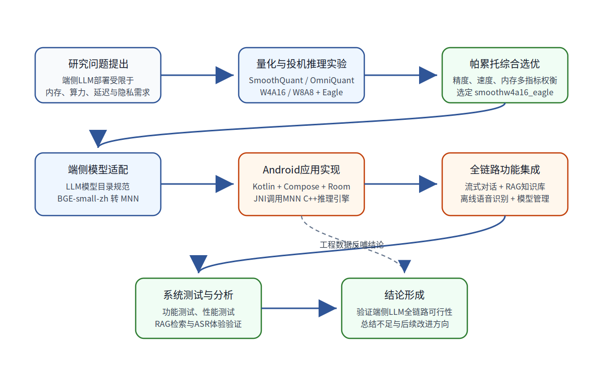

# 面向端侧部署的大语言模型量化与投机推理方法研究及安卓应用实现

> 说明：本文件是在现有大纲、项目代码与实验材料基础上生成的本科毕业论文扩充稿。当前先完成第1章“绪论”的扩充，后续章节可继续在同一写作风格下逐章追加。文中涉及的模型性能、可用性与选型结论优先采用项目目录中的真实实验结果。

## 摘要撰写预留

本文面向移动设备资源受限场景下的大语言模型本地化部署问题，围绕模型量化、投机推理与 Android 端侧应用实现展开研究。后续章节完成后，应在此处补充中文摘要、关键词、英文摘要与 Keywords。

## 第1章 绪论

### 1.1 课题背景及研究的目的和意义

近年来，大语言模型（Large Language Model，LLM）在自然语言理解、文本生成、多轮对话、代码辅助和知识问答等任务中表现出较强的通用能力。随着模型参数规模和上下文处理能力持续提升，LLM 正逐渐从云端服务形态向个人终端、移动设备和嵌入式设备延伸。相较于云端推理，端侧部署具有数据不出设备、网络依赖低、响应链路短和个性化能力更强等优势，特别适合私有文档问答、移动智能助手、离线语音交互和现场辅助决策等应用场景。

然而，大语言模型在端侧部署过程中仍面临明显的资源约束。移动设备的 CPU、GPU、NPU、内存容量、电池续航和散热能力均显著弱于服务器环境，而 LLM 推理通常需要加载大规模权重并持续执行矩阵乘法计算。以数十亿参数规模的模型为例，即使采用半精度浮点格式，模型权重、KV Cache 和中间激活也可能占用数 GB 内存，直接在普通 Android 手机上部署容易出现加载时间过长、生成速度偏低、内存占用过高甚至进程被系统回收等问题。因此，如何在保持模型能力的前提下降低推理资源消耗，是端侧 LLM 应用落地的关键问题。

模型量化是解决上述问题的重要技术路线。量化通过降低权重或激活值的表示位宽，将 FP16/FP32 等浮点计算转化为更低位宽的整数或混合精度计算，从而减少模型存储空间、降低内存带宽压力并提升推理速度。与此同时，投机解码通过引入较小的草稿模型或预测模块提前生成候选 token，再由主模型进行验证，可在保证生成结果一致性的前提下减少主模型调用次数，提高自回归生成阶段的吞吐率。对于端侧 LLM 而言，量化侧重降低“单次推理成本”，投机解码侧重减少“生成过程调用次数”，二者具有互补性。

除基础推理能力外，移动端智能助手还需要具备本地知识增强和自然交互能力。单纯依赖模型参数记忆的 LLM 存在知识截止时间固定、无法访问用户本地资料、容易产生幻觉等问题。检索增强生成（Retrieval-Augmented Generation，RAG）通过将用户文档切分、向量化并存入本地知识库，在问答时检索相关片段并注入提示词，可提升回答的事实依据和个性化能力。另一方面，移动设备的使用场景具有碎片化、移动化和操作不便等特点，纯文本输入无法满足所有交互需求，离线语音识别可以在无网络条件下将语音转写为文本，为端侧助手提供更自然的输入方式。

基于上述背景，本文以“端侧部署的大语言模型量化与投机推理方法研究及安卓应用实现”为主题，首先在实验层面对多种量化和投机推理组合进行评估，然后将筛选出的部署方案集成到 Android 应用中，实现包含流式对话、RAG 知识库、离线语音输入、模型切换和提示词模板管理的端侧 LLM 验证平台。该研究具有以下意义：

（1）在研究层面，本文通过 SmoothQuant、OmniQuant、不同量化位宽以及 Eagle 投机推理的交叉实验，比较不同模型压缩与加速策略在精度、速度和内存占用方面的差异，为端侧模型选型提供实验依据。

（2）在工程层面，本文将实验筛选出的模型方案部署到真实 Android 应用环境中，通过 JNI 调用 MNN 推理能力，并集成 Room 数据库、Jetpack Compose 界面、RAG 检索和 Vosk 语音识别，从系统角度验证端侧 LLM 全链路运行的可行性。

（3）在应用层面，本文关注“纯离线、本地知识增强、语音交互和多模型方案切换”四类能力，使应用不只停留在单一聊天演示，而是更接近真实移动智能助手的使用流程。

### 1.2 国内外在该方向的研究现状及分析

#### 1.2.1 大语言模型端侧部署研究现状

现有 LLM 部署方式主要包括云端推理、边缘服务器推理和端侧本地推理三类。云端推理依托服务器集群和高性能 GPU，能够运行更大规模的模型，但需要持续网络连接，并存在隐私数据上传、服务成本和响应链路较长等问题。边缘服务器推理通过在用户附近部署计算节点缩短访问链路，但仍无法完全消除网络依赖。端侧本地推理则将模型权重和推理引擎直接部署在用户设备上，能够在离线状态下提供服务，并避免敏感数据离开设备。

目前已有 MLC Chat、llama.cpp Android 移植和 PocketPal 等端侧 LLM 应用或框架。这些方案证明了在移动设备上运行中小规模 LLM 的可行性，但多数工作仍以基础文本对话和模型加载为主，对 RAG 本地知识库、离线语音输入、模型方案对比、投机解码加速以及完整工程链路测试的支持相对有限。对于本科毕业设计而言，仅实现一个能调用模型的聊天界面不足以充分体现端侧 LLM 的技术难点；更有价值的问题是：在真实 Android 系统的内存管理、JNI 调用、UI 线程调度、文件访问权限和多组件并发约束下，量化 LLM、Embedding 检索和语音识别能否协同工作。

表1-1对典型端侧 LLM 方案与本文工作的功能进行对比。

**表1-1 典型端侧 LLM 方案功能对比**

| 功能维度 | MLC Chat | llama.cpp Android移植 | PocketPal | 本文工作 |
| --- | --- | --- | --- | --- |
| 离线 LLM 推理 | 支持 | 支持 | 支持 | 支持 |
| 流式对话 | 支持 | 支持 | 支持 | 支持 |
| 量化方案对比 | 部分支持 | 部分支持 | 较弱 | 支持，包含多组量化与 Eagle 对比 |
| 投机解码实验 | 较少涉及 | 较少涉及 | 较少涉及 | 支持 Eagle 组合评估 |
| 本地 RAG 知识库 | 较少涉及 | 较少涉及 | 较少涉及 | 支持 PDF、TXT、Markdown、DOCX 导入与检索 |
| 离线语音输入 | 较少涉及 | 较少涉及 | 较少涉及 | 支持 Vosk 离线中文识别 |
| 多会话管理 | 部分支持 | 视实现而定 | 支持 | 支持 |
| 提示词模板管理 | 较少涉及 | 较少涉及 | 较少涉及 | 支持 |
| Android 全链路工程验证 | 部分涉及 | 部分涉及 | 部分涉及 | 重点验证 |

由表1-1可见，现有方案多从“模型能否在端侧跑起来”这一角度出发，而本文更强调“模型优化方案能否在真实端侧应用中稳定发挥作用”。因此，本文不仅关注单次推理速度，也关注知识库构建、向量检索、语音输入、UI 流式渲染和本地持久化等应用链路。

#### 1.2.2 模型量化研究现状

模型量化按训练参与程度可分为量化感知训练和训练后量化。量化感知训练在训练过程中模拟低精度计算，通常能够获得较好的精度保持效果，但训练成本较高，不适合所有模型和应用场景。训练后量化则在已有模型基础上利用少量校准数据完成权重或激活范围估计，部署成本较低，更适合端侧应用快速适配。

在大语言模型量化研究中，GPTQ、AWQ、SmoothQuant 和 OmniQuant 等方法被广泛关注。SmoothQuant 通过平滑权重和激活分布，将激活异常值压力转移到权重侧，降低低位宽量化难度。OmniQuant 则通过可学习参数进一步优化量化误差，试图在较低位宽下保持模型精度。对于端侧部署而言，W4A16 和 W8A8 是常见的两类混合精度或整数化方案：前者主要压缩权重，通常可以显著降低模型体积；后者同时压缩权重和激活，理论上具有更高计算加速潜力，但对模型分布和算子支持要求更高。

本文实验结果显示，并非所有低位宽方案都适合直接部署。项目实验记录中，`smoothw8a8` 和 `smoothw8a8_eagle` 被标记为不可用，原因是量化效果不好；而 `smoothw4a16_eagle` 在有效候选模型中取得综合最优结果，其 decode 速度达到 37.1 tokens/s，内存占用为 2.93 GB，综合加权得分为 0.6885。这说明端侧模型选型不能只依据理论压缩率，而应综合考虑精度退化、推理速度、内存占用和框架兼容性。

#### 1.2.3 投机解码研究现状

自回归语言模型在生成阶段需要逐 token 迭代，每生成一个 token 都依赖前序上下文。该机制使 decode 阶段难以充分并行化，尤其在移动端 CPU 或移动 GPU 上容易成为性能瓶颈。投机解码通过草稿模型先生成若干候选 token，再由主模型一次性验证，从而减少主模型调用次数。当草稿结果被主模型接受时，可以在不改变最终分布或尽量保持输出质量的前提下提升生成速度。

Eagle 属于面向 LLM 推理加速的投机生成方法。相较于简单使用小模型进行候选生成，Eagle 利用更贴近主模型隐藏状态或生成分布的预测机制，提高候选 token 的接受率。对端侧部署而言，Eagle 的优势在于能够提升 decode 吞吐率，但代价是需要额外加载草稿相关模型或模块，并增加一定内存消耗。因此，是否启用 Eagle 不能孤立判断，而需要与量化方案共同评估。

本文实验材料显示，不同模型启用 Eagle 后 decode 速度均有不同程度提升。例如，`smoothw4a16` 的 decode 速度为 19.26 tokens/s，叠加 Eagle 后 `smoothw4a16_eagle` 提升至 37.1 tokens/s；`omniw4a16` 从 22.62 tokens/s 提升至 `omniw4a16_eagle` 的 31.89 tokens/s。该结果表明，投机解码对于端侧生成阶段具有明显加速潜力，但最终选型仍需结合精度和内存进行多指标分析。

#### 1.2.4 端侧知识增强与语音交互研究现状

RAG 技术通过外部知识检索弥补模型参数知识的局限，通常包括文档解析、文本切片、向量化、相似度检索和提示词拼接等步骤。云端 RAG 系统通常依赖向量数据库和远程 Embedding 服务，而端侧 RAG 需要在本地完成文档读取、向量计算、向量存储和检索排序。Android 系统的文件访问权限、数据库存储效率和模型推理速度都会影响端侧 RAG 的用户体验。

语音输入是移动端应用的重要交互方式。在线语音识别服务准确率高、模型更新方便，但需要上传音频数据，不适合隐私敏感或离线环境。Vosk 等离线语音识别框架提供了在本地运行小型声学模型的能力，能够满足基础语音转写需求。本文将 Vosk 集成到 Android 应用中，使用户可以通过语音输入问题，再由本地 LLM 或 RAG 流程完成回答，从而形成“语音输入—文本理解—知识检索—LLM生成—流式展示”的端侧交互闭环。

### 1.3 本文主要研究内容

本文围绕端侧 LLM 部署的“模型优化—方案选型—系统实现—测试验证”展开，主要研究内容如下。

（1）构建面向端侧部署的量化与投机推理实验。本文以项目中的端侧多模态大模型部署需求为背景，对 FP16 基线、SmoothQuant、OmniQuant、W4A16、W8A8 以及 Eagle 投机推理组合进行实验比较。根据实验记录，共有 8 个有效候选模型进入帕累托分析，优化目标包括 accuracy、decode speed 和 memory。

（2）基于真实实验数据完成模型部署方案选优。实验结果显示，`fp16` 的 decode 速度为 3.49 tokens/s，`fp16_eagle` 为 29.95 tokens/s，`omniw4a16_eagle` 为 31.89 tokens/s，`smoothw4a16_eagle` 为 37.1 tokens/s。帕累托分析最终选择 `smoothw4a16_eagle`，其平均得分为 0.2098，decode 速度为 37.1 tokens/s，内存占用为 2.93 GB，综合加权得分为 0.6885。本文后续系统实现以该结果作为端侧部署方案的重要依据。

（3）实现 Android 端侧 LLM 应用系统。系统采用 Kotlin 和 Jetpack Compose 构建界面，使用 Room 进行本地数据持久化，通过 JNI 调用 C++ 层 MNN 推理能力。应用包括聊天对话、模型管理、知识库管理、提示词模板管理和设置等功能模块，能够支撑多会话隔离、流式生成和模型切换等典型使用流程。

（4）实现本地 RAG 知识库能力。系统支持用户导入 PDF、TXT、Markdown 和 DOCX 文档，将文档复制到应用内部存储后进行解析、切片和向量化。Embedding 模型在端侧运行，生成的向量与文档分块信息存入本地数据库。用户提问时，系统可检索相似分块并作为上下文注入提示词，从而提升回答的依据性。

（5）集成离线语音识别能力。系统通过 Vosk 实现本地语音识别，将用户语音实时转写为文本输入，避免依赖云端语音服务。该模块与聊天输入框和推理流程联动，为移动端场景提供更自然的交互方式。

（6）开展系统测试与结果分析。本文将结合功能测试、模型推理性能测试、RAG 检索测试和语音识别测试，对系统可用性和端侧部署效果进行分析，并讨论 PC 端实验结果与 Android 真机运行环境之间的差异。

### 1.4 本文技术路线

本文的技术路线如图1-1所示。整体流程从端侧 LLM 部署问题出发，首先进行量化与投机推理实验，得到适合端侧部署的模型方案；随后将该方案与 Embedding、RAG 和 ASR 组件共同集成到 Android 应用中；最后通过功能和性能测试验证系统的可用性，并形成结论。

**图1-1 本文研究技术路线图**

从图1-1可以看出，本文并不是单纯进行模型压缩实验，也不是单纯开发聊天应用，而是将二者结合起来：第3章的实验结果为第4章和第5章的端侧应用设计提供模型选型依据；第6章的系统测试则反过来验证第3章中选定方案在真实移动环境中的工程可行性。

### 1.5 本文创新点

结合研究目标和项目实现，本文的创新点主要体现在以下方面。

（1）提出面向端侧部署的多指标模型选型流程。本文不只比较单一精度或速度指标，而是综合考虑精度、decode 速度、内存占用和模型可用性，利用帕累托前沿方法筛选候选方案。实验结果表明，`smoothw4a16_eagle` 在有效候选模型中具有较优综合表现。

（2）系统比较量化方法与投机解码的组合效果。本文将 SmoothQuant、OmniQuant、W4A16、W8A8 和 Eagle 投机推理进行组合分析，观察不同量化方案叠加 Eagle 后的速度提升和可用性差异，为端侧 LLM 加速提供实验参考。

（3）构建端侧 LLM 全链路工程验证平台。本文实现的 Android 应用不仅包括基础 LLM 对话，还集成了本地 RAG 知识库、Embedding 向量化、离线语音识别、模型管理和提示词模板管理，能够从真实应用链路角度验证端侧 LLM 部署效果。

（4）针对 Android 环境完成 JNI 与本地存储适配。系统通过 JNI 连接 Kotlin 层与 C++ MNN 推理层，同时考虑 Android Scoped Storage 限制，将外部文档复制到应用内部存储后再进行解析和向量化，解决了 C++ 层直接访问外部文件不稳定的问题。

### 1.6 本文结构安排

本文共分为六章和结论部分，各章内容安排如下。

第1章为绪论。主要介绍端侧 LLM 部署的研究背景、目的和意义，分析模型量化、投机解码、端侧 RAG 和离线语音交互的发展现状，明确本文研究内容、技术路线和创新点。

第2章为相关技术基础。主要介绍大语言模型量化技术、投机解码技术、MNN 推理框架、RAG 与 Embedding 技术、Vosk 离线语音识别技术，以及 Android MVVM、Room、Jetpack Compose 和 JNI 等工程实现基础。

第3章为面向端侧的模型量化与投机推理实验。主要说明实验模型、数据集、量化方案、Eagle 配置、评估指标和实验环境，并基于真实实验结果分析不同模型方案在精度、速度和内存方面的表现，最终通过帕累托前沿方法确定端侧部署推荐方案。

第4章为端侧 LLM 应用系统需求分析与概要设计。主要分析系统业务流程、功能性需求、非功能性需求和用例模型，给出系统总体架构、数据库设计和核心模块概要设计。

第5章为端侧 LLM 应用系统详细设计与实现。主要介绍 Android 工程结构、LLM 推理模块、JNI 接口、C++ 侧推理实现、RAG 知识库模块、语音识别模块以及 UI 与状态管理的具体实现。

第6章为系统测试与结果分析。主要围绕功能测试、推理性能、RAG 检索耗时、语音识别效果和整体应用体验展开测试，并对测试结果进行分析。

结论部分总结全文工作，归纳模型选型、端侧应用实现和系统测试结果，分析当前工作的不足，并展望后续可改进方向。

### 1.7 本章小结

本章首先分析了大语言模型向移动端部署的发展趋势，指出端侧 LLM 在隐私保护、离线可用和低延迟交互方面具有重要价值，同时也面临内存、算力、功耗和系统集成复杂度等挑战。随后，本章从端侧部署、模型量化、投机解码、RAG 知识增强和离线语音识别等方面梳理了相关研究现状，并结合项目真实实验结果说明本文开展量化选型与 Android 工程验证的必要性。最后，本章明确了本文的主要研究内容、技术路线、创新点和章节安排，为后续相关技术基础、实验设计、系统设计与实现、测试分析奠定了基础。
